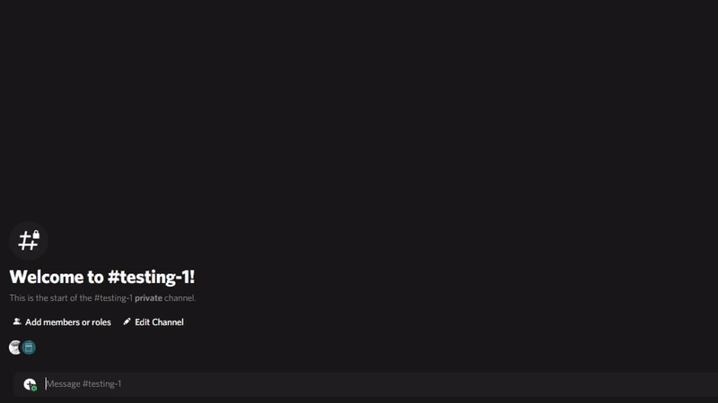

<!-- markdownlint-disable -->

    </a>

<h3 align="center">fpsmath</h3>

<!-- markdownlint-restore -->

---

## 🧐 About

FPSMath is just a handy little bot that helps with converting everything related to video games from sensitivity to field of view. It supports [over 20 games](https://fpsmath.xyz/games/) and 5 units(cm/rev, inch/rev, MPI, arcmin and deg/mm) and are happy to add plenty more.

## 🎈 Usage/Commands

See [Commands Overview](https://fpsmath.xyz/commands/)

## 🏁 Getting Started

[Invite the bot to your server](https://fpsmath.xyz/invite).

See [Getting Started](https://fpsmath.xyz/getting-started/) for more information and guidance for using the hosted bot.

## ✍️ Contributing

If you are interested in contributing or helping with creation of this bot please read [the code of conduct](.github/code_of_conduct.md) and [the contributing guide and guidelines](.github/contributing.md)

As well for any questions regarding development or usage join the [support Discord server](https://fpsmath.xyz/support)

## ⛏️ Built Using

- Rust
- Twilight
- Tokio

## ✨ Contributors

Thanks goes to these wonderful people ([emoji key](https://allcontributors.org/docs/en/emoji-key)):

<!-- ALL-CONTRIBUTORS-LIST:START - Do not remove or modify this section -->
<!-- prettier-ignore-start -->
<!-- markdownlint-disable -->
<table>
  <tr>
    <td align="center"><a href="https://animafps.xyz"> <b>Anima.</b></a> <a href="https://github.com/animafps/fpsmath/commits?author=animafps" title="Code">💻</a> <a href="https://github.com/animafps/fpsmath/commits?author=animafps" title="Documentation">📖</a> <a href="#design-animafps" title="Design">🎨</a> <a href="#ideas-animafps" title="Ideas, Planning, & Feedback">🤔</a> <a href="#infra-animafps" title="Infrastructure (Hosting, Build-Tools, etc)">🚇</a> <a href="#projectManagement-animafps" title="Project Management">📆</a></td>
    <td align="center"><a href="https://github.com/apps/renovate"> <b>renovate[bot]</b></a> <a href="#maintenance-renovate[bot]" title="Maintenance">🚧</a></td>
    <td align="center"><a href="https://github.com/apps/allcontributors"> <b>allcontributors[bot]</b></a> <a href="https://github.com/animafps/fpsmath/commits?author=allcontributors[bot]" title="Documentation">📖</a></td>
    <td align="center"><a href="https://github.com/apps/dependabot"> <b>dependabot[bot]</b></a> <a href="#maintenance-dependabot[bot]" title="Maintenance">🚧</a></td>
  </tr>
</table>

<!-- markdownlint-restore -->
<!-- prettier-ignore-end -->

<!-- ALL-CONTRIBUTORS-LIST:END -->

This project follows the [all-contributors](https://github.com/all-contributors/all-contributors) specification. Contributions of any kind welcome!

## 🎉 Acknowledgements

- [Kovaak's Sensitivity Matcher Script](https://github.com/KovaaK/SensitivityMatcher) - Tool used to find the yaw values
- [Sensitivity-Converter-Bot](https://github.com/JSanchezIO/Sensitivity-Converter-Bot) - The inspiration for me making this bot
- Nocro - Helped with the initial math equations
- [Kovaak's Website/Articles](https://kovaak.com) - Source of many of the terms and ideas used in the bot

## ⚠️ License

The source code of the fpsmath bot are licensed under [AGPLv3](license). The content of the documentation(docs/) is licensed under [Creative Commons Attribution-ShareAlike 4.0 International](docs/license).
